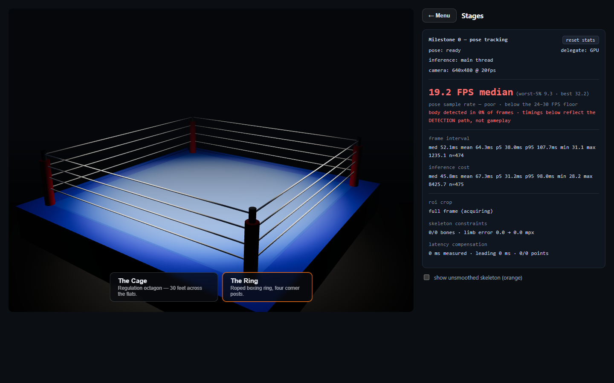

# Shadow Box

**A boxing game you play with your body.** Stand in front of a webcam, throw
real punches, slip and duck real punches. The browser tracks your pose in real
time and turns it into the fight. No controller, no wearables, no install.

Everything runs **client-side**. The camera feed never leaves the machine.



---

## Getting started

```bash
npm install
npm run dev          # http://localhost:5174
```

| Command | What it does |
| --- | --- |
| `npm run dev` | Dev server. |
| `npm run build` | Type-check and build. |
| `npm test` | 487 unit tests. |
| `npm run lint` | oxlint. |
| `npm run smoke` | Builds, then drives the real app in headless Chromium with a fake camera. |
| `npm run measure:sweep` | Measures the pose pipeline on this machine. |

The smoke run needs `npm run preview` in another terminal.

---

## What it does

### Camera-driven everything

The menu is navigated with your body. Your hand moves a cursor; holding it over
a row fills a ring and confirms. **Four independent defences** stop an
accidental press: a dwell time, a movement tolerance, a re-arm after each press,
and a dead zone on first hover. Escape always returns to the menu, because a
camera-driven UI needs one way out that does not depend on the camera.

### Training: the punching dummy

A torso on a stand, with **ten lit target zones**. It scores accuracy (radial
miss distance, smooth rather than pass/fail), power (resolved damage) and timing
(reaction latency).

It **learns**. A persistent profile keeps per-zone exponential moving averages
and separates two things that look identical in raw numbers:

- **Setup error** — a consistent bias, the same direction on every zone. That is
  the camera's framing or your stance, and it is corrected for you.
- **Your technique** — what is left once the common-mode bias is removed.

Bias is estimated with median/MAD statistics across zones, so one bad zone
cannot drag the correction. Misses update your accuracy but contribute nothing
to the bias estimate, and means are taken over landed targets only — so standing
still can never report 100%.

### Fighting: a CPU opponent that moves

The opponent runs **three state machines on independent clocks** — attack,
footwork and head movement — because a fighter whose feet stop between punches
is obviously a state machine.

- **It manages range.** It circles, steps in to throw and backs out again, and
  it will not throw from outside its own reach.
- **It telegraphs.** Every punch has a visible wind-up, down to 260ms at the
  hardest difficulty. That is the entire basis of the genre, and it is doubly
  necessary here because your own input arrives through a webcam at ~19 FPS.
- **It slips, ducks and blocks, and they are different moves.** A slip beats a
  straight or rising punch that has committed to a line; it does **not** beat a
  hook, which curves around the outside and arrives where the head has just
  moved to. A duck gets under any arc and does nothing at all about a body shot.
  Evading costs stamina, so slipping everything gasses a fighter out.
- **It is deterministic.** Every random choice comes from a seeded generator, so
  a fight is reproducible — a hard prerequisite for the rollback netcode.

It cannot read your mind: it defends the side you have *been* going to, which is
the same information a person in front of you would have.

### Stages

A regulation **octagon** (30 feet across the flats, derived from the 750 sq ft
floor figure rather than guessed) and a championship **boxing ring** (20 feet
inside the ropes, four ropes, corner posts). Both are procedural — no asset to
licence, and both rescale from a single number.

---

## Tracking

Five whole-body channels, all from x/y only.

| Channel | How it is measured |
| --- | --- |
| Slip | Shoulder-midpoint travel, torso-normalised. |
| Rise | Same, vertical. |
| Step | Apparent torso **size**: `Δ = D·(1 − s₀/s)`. |
| Turn | Shoulder-line foreshortening: `\|yaw\| = acos(w/w₀)`. |
| Crouch | Derived from the vertical channel. |

**MediaPipe's `z` is never read.** It degrades exactly along the axis a punch
travels. A test poisons every `z` value and asserts the output is identical.

Two honest limits are written into the code rather than papered over. The
camera distance `D` cannot be measured by an uncalibrated webcam, so it is
stated as an assumption and acts purely as that channel's gain — wrong by a
factor of two and the character steps half or twice as far, but never the wrong
way. And the **sign** of a torso turn is not observable from the front at all:
turning left and right narrow the shoulder line identically. It is taken from
stance instead, because a boxer does not turn both ways.

### The pipeline tunes itself, visibly

A tracking monitor grades the signal continuously and adjusts smoothing and
prediction to match it. Because something that changes how the game responds
without being asked must be able to say what it changed, `TrackingPanel` shows
the grade, every metric, the weakest landmark by name, and what it adjusted.

**Nothing that decides whether a punch landed may be auto-tuned.** The monitor
exposes exactly two knobs, and a test asserts it exposes only those two.

---

## The character

A 0.40 MB rigged mesh, 18 driven joints, generated offline from Meta's MHR body
model and driven live by the same landmarks the game already tracks.

Ducking is a real duck: the knees bend, the waist folds, and the root drops by
**exactly** the height the knees gave up, computed from the bones' own measured
lengths — so the feet stay on the canvas instead of the figure sinking through
it with its legs straight.

Bruises paint where the strike resolved, fresh red darkening to purple over 2.5s
and fading over 22s. Head snap and jaw drop are bone-driven using the 14 facial
bones already in the mesh, so they cost nothing in download size.

Anything that could be *solved* is solved rather than hardcoded: finger curl
axes, finger adduction, the jaw hinge, the knee-bend direction. Each one is a
coin flip that renders as a subtly broken character and would need re-checking
by hand on every re-export.

---

## Stack

| | |
| --- | --- |
| Pose | `@mediapipe/tasks-vision` PoseLandmarker, GPU delegate with CPU fallback |
| UI | React 19 + TypeScript 5 |
| 3D | three.js r185 |
| Build | Vite 7 (rolldown) |
| Test | Vitest — unit tests plus Playwright end-to-end |
| Lint | oxlint |
| Character | Meta MHR (Apache-2.0), exported offline via FBX2glTF, kit authored in Blender |

**No Python and no GPU inference in the runtime path.** The asset pipeline is
offline and one-time; it ships a static `.glb`.

---

## Ground rules

- Perception never reads the character mesh. What you hit must not depend on how
  you are drawn.
- MediaPipe `z` is never read for classification.
- No threshold that decides whether a punch landed may be auto-tuned.
- Only classified, discrete events will cross the network — never raw landmarks,
  never video.
- Licence-clean only. No copyleft models, no ripped game assets.

These are enforced by tests, not convention.

---

## Status

Honest about what is proven and what is not.

**Working:** the dummy training system and its learning loop, the camera-driven
menu, the CPU opponent, both stages, five-channel body tracking, the
self-tuning pipeline, damage and bruising.

**Measured:** ~19 FPS median pose rate on the development machine, against a
hard inference ceiling of ~27.8 FPS. Torso tracking follows 99% of requested
lean between 5° and 45°.

**Not solved:** four-way punch *type* classification (jab / cross / hook /
uppercut) from a single frontal camera sits at ~19% detection and is the
project's core open risk. Hit resolution deliberately does not depend on it —
reach and zone are a far easier measurement than punch type, and tying the two
together would have made every hit inherit that number.

**Not started:** multiplayer. LAN first, then internet with a TURN relay.

**Not verified:** phone-camera framing has its own calibration to do, and no
WCAG audit has been performed. This is a physical-movement game and has an
inherent accessibility ceiling worth naming plainly.

---

## Layout

```
src/
  capture/      camera
  pose/         inference, smoothing, prediction, tracking quality
  perception/   landmarks to meaning: strikes, body motion, dodges
  sim/          health, stamina, scoring, the CPU opponent
  training/     dummy drills, scoring, the persistent profile
  menu/         modes and stages as data
  render/       three.js
  ui/           React
  config/       every tunable constant
docs/           architecture, asset pipeline
blender/        offline kit authoring
tools/          measurement and the end-to-end smoke test
```

More in [`docs/ARCHITECTURE.md`](docs/ARCHITECTURE.md) and
[`docs/ASSET-PIPELINE.md`](docs/ASSET-PIPELINE.md).
